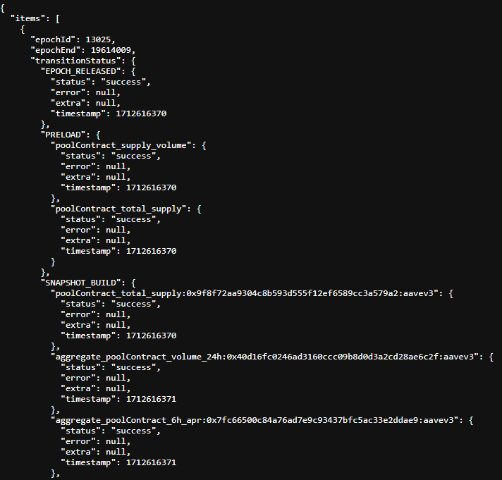
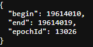

# PowerLoom Deployment
Scripts to deploy PowerLoom snapshotter node [pooler](https://github.com/PowerLoom/pooler) to [Powerloom Network](https://powerloom.network).

## Requirements

1. Latest version of `docker` (`>= 20.10.21`) and `docker-compose` (`>= v2.13.0`)
2. At least 4 core CPU, 8GB RAM and 50GB SSD - make sure to choose the correct spec when deploying to Github Codespaces.
3. IPFS node
    - While we have __included__ a node in our autobuild docker setup, IPFS daemon can hog __*a lot*__ of resources - it is not recommended to run this on a personal computer unless you have a strong internet connection and dedicated CPU+RAM.
    - 3rd party IPFS services that provide default IFPS interface like Infura are now supported.
4. RPC URL for `Ethereum mainnet` or the chain you're working on. We recommend running a full node to save costs and to stick to ethos of decentralization! :)
> While the current testnet setup defaults to a "lite mode" and works with free RPCs, it's highly recommended to signup with one of these providers to at least track usage even if you aren't on a paid plan: [Alchemy](https://alchemy.com/?r=15ce6db6d0a109d5), [Infura](https://infura.io), [Quicknode](https://www.quicknode.com?tap_a=67226-09396e&tap_s=3491854-f4a458), etc. Please reach out to us if none of the options are viable.


## Running the Snapshotter Node

Clone the repository against the testnet branch.

 `git clone https://github.com/PowerLoom/deploy.git --single-branch powerloom_deploy --branch main && cd powerloom_deploy`


### For snapshotters

1. Copy `env.example` to `.env`.
   - Ensure the following required variables are filled:
     - `SOURCE_RPC_URL`: The URL for Ethereum RPC (Local node/Infura/Alchemy) service.
     - `SIGNER_ACCOUNT_ADDRESS`: The address of the signer account. This is your whitelisted address on the protocol. **Using a burner account is highly recommended**
     - `SIGNER_ACCOUNT_PRIVATE_KEY`: The private key corresponding to the signer account address.
   - Optionally, you may also set the following variables:
     - `PROST_RPC_URL`: The URL for the PROST RPC service.
     - `PROTOCOL_STATE_CONTRACT`: The contract address for the protocol state.
     - `RELAYER_HOST`: The host address for the relayer.
     - `NAMESPACE`: The unique key used to identify your project namespace around which all consensus activity takes place.
     - `POWERLOOM_REPORTING_URL`: The URL for reporting to PowerLoom.
     - `PROST_CHAIN_ID`: The chain ID for the PROST RPC service.
     - `IPFS_URL`: The URL for the IPFS (InterPlanetary File System) service in HTTP(s) (e.g. `https://ipfs.infura.io:5001`) multiaddr format (e.g. `/dns4/ipfs.infura.io/tcp/5001/https`)
     - `IPFS_API_KEY`: The API key for the IPFS service (if required).
     - `IPFS_API_SECRET`: The API secret for the IPFS service (if required).
     - `SLACK_REPORTING_URL`: The URL for reporting to Slack.
     - `WEB3_STORAGE_TOKEN`: The token for Web3.Storage. You can generate or retrieve this token from your [API tokens page](https://web3.storage/tokens/?create=true) after signing up for a free plan at web3.storage.

2. Run the following command (ideally in a `screen`) and follow instructions

    `./build.sh`

3. Once all the services are up and running, the front-end can be accessed via [Pooler Frontend](https://github.com/PowerLoom/pooler-frontend) to see a UNISWAPV2 summary data dashboard similar to [PowerLoom UNISWAPV2 Prod](https://uniswapv2.powerloom.io/).
    - A sample screenshot of the dashboard is given [here](./sample_images/pooler-frontend.jpg)

    - This will also give an idea in case your snapshotting has fallen behind as you can notice from the time of last snapshot shown in the screenshot.

    - Note that the data shown in your own dashboard will not be same as production UI on PowerLoom.io as the "lite mode" is only set to snapshot 7 pair contracts. Refer to contributors section below to enable all pairs.

4. We have setup a bare-bones consensus dashboard at: [consensus.powerloom.io](https://onchain-consensus.powerloom.io)


### For Code Contributors

Building your own use case is easy. Just follow the steps below:

1. Fork [snapshotter-computes](https://github.com/PowerLoom/snapshotter-computes) and [snapshotter-configs](https://github.com/PowerLoom/snapshotter-configs/) templates
 
2. Copy `env-dev.example` to `.env`.
   - Ensure the following required variables are filled:
     - `SOURCE_RPC_URL`: The URL for Ethereum RPC (Local node/Infura/Alchemy) service.
     - `SIGNER_ACCOUNT_ADDRESS`: The address of the signer account. This is your whitelisted address on the protocol. **Using a burner account is highly recommended**
     - `SIGNER_ACCOUNT_PRIVATE_KEY`: The private key corresponding to the signer account address.
     - Configure `SNAPSHOT_CONFIG_REPO` and `SNAPSHOT_CONFIG_REPO_BRANCH` to point to your forked snapshotter-configs repository.
     - Configure `SNAPSHOTTER_COMPUTE_REPO` and `SNAPSHOTTER_COMPUTE_REPO_BRANCH` to point to your forked snapshotter-computes repository.
   - Optionally, you may also set the following variables:
     - `PROST_RPC_URL`: The URL for the PROST RPC service.
     - `PROTOCOL_STATE_CONTRACT`: The contract address for the protocol state.
     - `RELAYER_HOST`: The host address for the relayer.
     - `NAMESPACE`: The unique key used to identify your project namespace around which all consensus activity takes place.
     - `POWERLOOM_REPORTING_URL`: The URL for reporting to PowerLoom.
     - `PROST_CHAIN_ID`: The chain ID for the PROST RPC service.
     - `IPFS_URL`: The URL for the IPFS (InterPlanetary File System) service in HTTP(s) (e.g. `https://ipfs.infura.io:5001`) multiaddr format (e.g. `/dns4/ipfs.infura.io/tcp/5001/https`)
     - `IPFS_API_KEY`: The API key for the IPFS service (if required).
     - `IPFS_API_SECRET`: The API secret for the IPFS service (if required).
     - `SLACK_REPORTING_URL`: The URL for reporting to Slack.
     - `WEB3_STORAGE_TOKEN`: The token for Web3.Storage. You can generate or retrieve this token from your [API tokens page](https://web3.storage/tokens/?create=true) after signing up for a free plan at web3.storage.

3. Setup codebase by running `bootstrap.sh` using `./bootstrap.sh` command.
   
   **Note**- This is a one time step and resets the codebase to the latest version of the branch. If you have made any changes to the codebase, make sure to commit them before running this command.You need to run this command only once after cloning the repository.

4. Open a screen by typing `screen` and then follow instructions by running (if you're not using a server, you can skip starting a screen session)


    `./build-dev.sh`

    If the `.env` is filled up correctly, all services will execute one by one. The logs do fill up quick. So, remember to [safely detach](https://linuxize.com/post/how-to-use-linux-screen/) from screen when not using it. 


## Troubleshooting

1. If you see the following error, your snapshotter address is not registered.

    ```
    powerloom_deploy-pooler-1           | Snapshotter identity check failed on protocol smart contract
    powerloom_deploy-pooler-1 exited with code 1
    ```
    You can reach out to us on [Discord](https://powerloom.io/discord) to get your address whitelisted.

2. Check if all the necessary docker containers are up and running. You should see an output against `docker ps` with the following cotnainers listed:

```
    # docker ps

    CONTAINER ID   IMAGE                      COMMAND                  CREATED              STATUS                        PORTS                                                                                                         NAMES

    cbeed6b78b1c   powerloom-pooler           "bash -c 'sh snapsho…"   About a minute ago   Up 49 seconds (healthy)       0.0.0.0:8002->8002/tcp, 0.0.0.0:8555->8555/tcp                                                                powerloom_deploy-pooler-1

    a8e7413cf980   rabbitmq:3-management      "docker-entrypoint.s…"   About a minute ago   Up About a minute (healthy)   4369/tcp, 5671/tcp, 0.0.0.0:5672->5672/tcp, 15671/tcp, 15691-15692/tcp, 25672/tcp, 0.0.0.0:15672->15672/tcp   powerloom_deploy-rabbitmq-1

    48c241b1c926   ipfs/kubo:release          "/bin/sh -c ' echo '…"   About a minute ago   Up About a minute (healthy)   4001/tcp, 8080-8081/tcp, 4001/udp, 0.0.0.0:5001->5001/tcp                                                     powerloom_deploy-ipfs-1

    64e2213cdcb3   redis:alpine               "docker-entrypoint.s…"   About a minute ago   Up About a minute (healthy)   0.0.0.0:6379->6379/tcp                                                                                        powerloom_deploy-redis-1
```

3. To be sure whether your snapshotter is processing epochs and submitting snapshots for consensus, run the following internal API query on Pooler Core API from your browser.

> For detailed documentation on internal APIs and the low level details exposed by them, refer to the Pooler docs.

**Tunnel from your local machine to the remote deploy instance on the [`core_api`](https://github.com/PowerLoom/pooler/blob/phase2/README.md#core-api) port**

This opens up port 8002.

```
ssh -nNTv -L 8002:localhost:8002 root@<remote-instance-IP-address>
```

Replace `<remote-instance-IP-address>` with the IPv4 address of the remote deploy instance.

The following query will return the processing status of the last epoch as it passes through the different state transitions.

**Check epoch processing status**

Visit `http://localhost:8002/internal/snapshotter/epochProcessingStatus?page=1&size=1` on your browser to know the status of the latest epoch processed by Pooler.



Most of the project IDs as captured at every state transition should show a status of `success`.

**Check the current epoch on the protocol**

Visit `http://localhost:8002/current_epoch` on your browser to know the current epoch being processed by the protocol. If the `epochId` field from the previous query and this one are too far apart, the deploy setup is most likely 

* running into RPC issues, or 
* system resource limit issues which causes the host to kill off processes



### Stopping and Resetting
1. To shutdown services, just press `Ctrl+C` (and again to force).

    > If you don't keep services running for extended periods of time, this will affect consensus and we may be forced to de-activate your snapshotter account.
    
2. If you see issues with data, you can do a clean *reset* by running the following command:

- For Snapshotters: `docker-compose --profile ipfs down --volumes`
- For Code Contributors: 
    `docker-compose -f docker-compose-dev.yaml --profile ipfs down --volumes`
